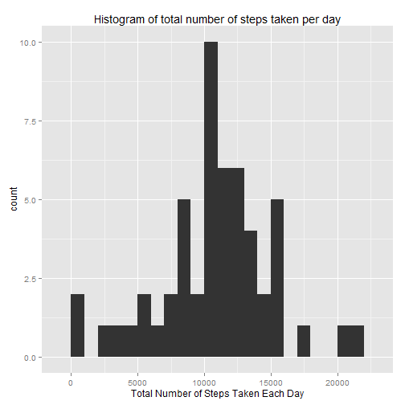

###**I. Loading and Preprocessing the Data** 

####1. Load the Data

```r
activity <-read.csv("activity.csv", header = TRUE)
names(activity)
```

```
## [1] "steps"    "date"     "interval"
```
####2. Process/ Transform the Data

```r
##Change date variable to date class function and steps and interval to numeric class
activity$date <-as.Date(activity$date, format= "%Y-%m-%d")
activity$steps <-as.numeric(activity$steps)
activity$interval<-as.numeric(activity$interval)
```

###**II. What is mean total number of steps taken per day?**

####1. Total number of steps taken per day


```r
totalsteps<-aggregate(steps~date,data = activity, FUN=sum, na.rm = TRUE)
```

####2. Histogram of the Total Number of Steps Taken per Day

```r
library(ggplot2)
qplot(totalsteps$steps, binwidth=1000, xlab = "Total Number of Steps Taken Each Day", main = "Histogram of total number of steps taken per day")
```

 

####3. Mean and Median of total number of steps taken per day

```r
mean(totalsteps$steps)
```

```
## [1] 10766.19
```

```r
median(totalsteps$steps)
```

```
## [1] 10765
```

###**III. What is the average daily activity pattern?**

####1. Time series plot of the 5-minute interval(x-axis) and the average number of steps taken, averaged across all days (y-axis)


```r
##Find average steps taken by interval
avesteps <- aggregate(steps~interval, data=activity, FUN = mean, na.rm=TRUE)

##rename steps to steps_mean
names(avesteps)[2]<-"steps_mean" 

##Create time series plot
ggplot(data=avesteps, aes(x= interval, y=steps_mean))+ geom_line()+xlab("5-minute interval")+ ylab("average number of steps taken") + ggtitle("Average number of steps taken" )
```

 

####2. 5-minute interval, on average across all the days in the dataset, that contains the maximum number of steps

```r
avesteps[which.max(avesteps$steps),"interval"]
```

```
## [1] 835
```

###**Imputing Missing Values**

####1.Calculate and report total number of missing values in the dataset

```r
nrow(activity[is.na(activity$steps),])
```

```
## [1] 2304
```
####2. Devise a strategy for filling in all of the missing values in the dataset
Mean values for the 5-minute interval will be used to fill in missing values

```r
library(plyr)
```

```
## Warning: package 'plyr' was built under R version 3.2.2
```

```r
## First, the join function from plyr package will be used to merge original dataset with values containing mean steps by interval
Datafill<-join(activity, avesteps, by="interval", type="left")

##Next, values with NA in 'steps' column will be filled by steps_mean values from the 'steps_mean' column
Datafill$steps[which(is.na(Datafill$steps))]<-Datafill$steps_mean[which(is.na(Datafill$steps))]
```
####3. Create a new dataset that is equal to the original dataset but with missing data filled in

```r
##The new dataset created from above steps will only retain the following three columns, where 'steps' has missing values filled in.
Datafill<-Datafill[, c("steps", "date", "interval")]
```
####4. Histogram of the total number of steps taken each day and Calculate and report the mean and median total number of steps taken per day. 

```r
##Total number of steps taken each day
totalsteps_new<-aggregate(steps~date,data = Datafill, FUN=sum, na.rm = TRUE)

#Histogram of the total number of steps taken each day with new dataset
qplot(totalsteps_new$steps, binwidth=1000, xlab = "Total Number of Steps Taken Each Day", main = "Histogram of total number of steps taken each day with new dataset")
```

 

```r
# Mean and Median total number of steps taken per day
mean(totalsteps_new$steps)
```

```
## [1] 10766.19
```

```r
median(totalsteps_new$steps)
```

```
## [1] 10766.19
```
####Do these values differ from the estimates from the first part of the assignment? What is the impact of imputing missing data on the estimates of the total daily number of steps?
The Mean is still the same, but the Median has changed. Since we imputed missing data with mean values, the Mean and Median are now the same. 

###**Are there differences in activity patterns between weekdays and weekends?**

####1. Create a new factor variable in the dataset with two levels- "weekday" and "weekend" indicating whether a given date is a weekday or weekend day.


```r
##First, change date variable into POSIXt date object
Datafill$date <-as.Date(Datafill$date) 
Datafill$date <-strptime(paste(Datafill$date), format = "%Y-%m-%d")

##Add a new variable 'weekday' with day of week based on time
Datafill$weekday<-paste(weekdays(Datafill$date))

## Create a subset of 'weekdays' with Monday to Friday
weekdays<-c("Monday", "Tuesday", "Wednesday", "Thursday", "Friday")

## Use the 'ifelse' argument with the 'is.element' set operations function: if element is in the 'weekdays' subset, result is "Weekday" or else it is "Weekend"  
Datafill$weekday =ifelse(is.element(weekdays(as.Date(Datafill$date)), weekdays), "Weekday", "Weekend")

##change 'weekday' to factor variable
Datafill$weekday= as.factor(Datafill$weekday)

##Create average number of steps by interval and weekday( weekday vs weekend)  
AveSteps_new <-aggregate(steps~interval + weekday, data = Datafill, FUN= mean)

##rename 'steps' as 'steps_mean'
names(AveSteps_new)[3]<-"steps_mean"
```

####A panel plot containing a time series plot of the 5-minute interval (x-axis) and the average number of steps taken, averaged across all weekday days or weekend days (y-axis).

```r
ggplot(data=AveSteps_new, aes(x= interval, y=steps_mean))+ geom_line()+ facet_grid(weekday~.)+xlab("5-minute interval")+ ylab("average number of steps taken")
```

 


